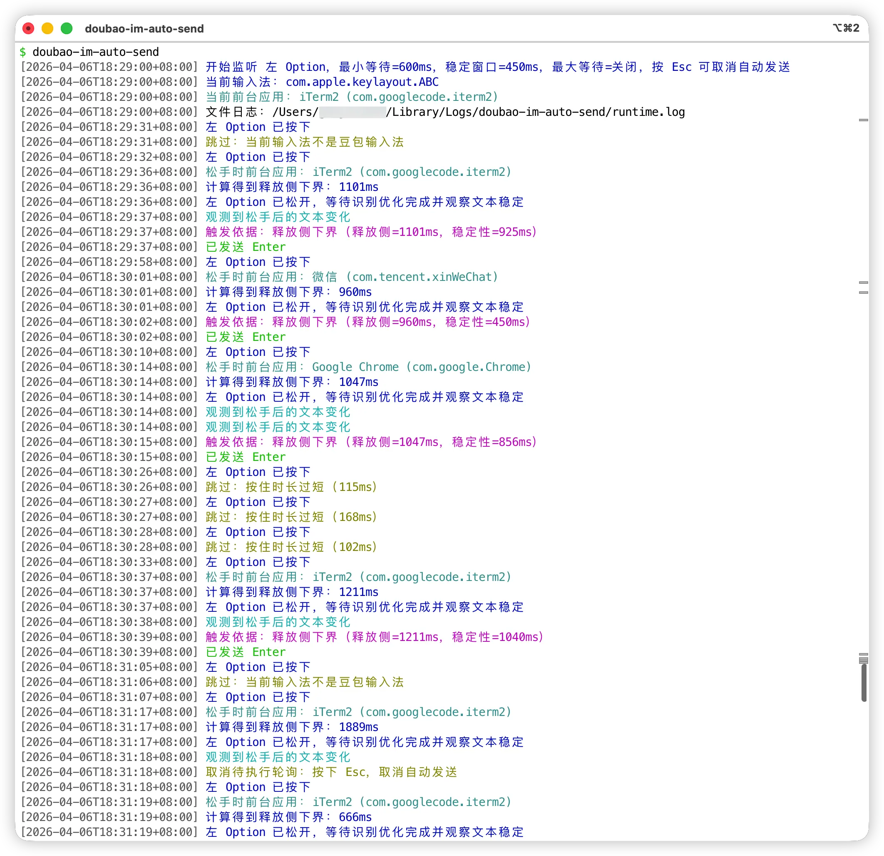

# doubao-im-auto-send

**A macOS Swift CLI that listens for Doubao IME voice input completion and automatically sends `Enter` after text becomes stable, with an optional MiniMax CN or Codex refine step before sending.**

> Requirements: macOS, Doubao IME, and your terminal app must have both “Input Monitoring” and “Accessibility” permissions enabled.

## Installation

```bash
curl -fsSL https://raw.githubusercontent.com/cleardusk/doubao-im-auto-send/main/install.sh | bash
```

If you prefer cloning first:

```bash
git clone --depth 1 https://github.com/cleardusk/doubao-im-auto-send.git && bash doubao-im-auto-send/install.sh
```

Inside the repository directory, you can also run:

```bash
bash install.sh
```

By default, it installs to `~/.local/bin/doubao-im-auto-send`. If that directory is not in your `PATH`, run it with the full path or add the directory to `PATH`. Executable command: **`doubao-im-auto-send`**.

## Quick Start

```bash
# Run with default parameters
doubao-im-auto-send

# Check current environment
doubao-im-auto-send --check
doubao-im-auto-send --help

# Enable refine
doubao-im-auto-send --refine

# Explicitly use MiniMax
doubao-im-auto-send --refine --refine-provider minimax

# Explicitly use MiniMax SSE
doubao-im-auto-send --refine --refine-provider minimax --refine-minimax-transport sse

# Explicitly use Codex SSE
doubao-im-auto-send --refine --refine-provider codex --refine-codex-transport sse

# Explicitly use Codex WebSocket
doubao-im-auto-send --refine --refine-provider codex --refine-codex-transport ws

# Test refine only, without event monitoring
doubao-im-auto-send --refine-text "This is basically basically what I mean"
```

## Runtime Example

Terminal log example (colors are enabled only in a TTY terminal):



## Default Behavior

- Default trigger key: Left `Option`
- `delay-ms=600`
- `per-second-postdelay-ms=130`
- `stable-ms=450`
- `poll-ms=50`
- `min-hold-ms=250`
- `max-wait` disabled by default
- Common editor apps are skipped by default, including VS Code, Cursor, Windsurf, JetBrains IDEs, Xcode, and Sublime
- Default file log: `~/Library/Logs/doubao-im-auto-send/runtime.log`
- Press `Esc` during the waiting-to-send phase to cancel auto-send
- `--refine` is disabled by default; when enabled, the configured refine provider runs before auto-send
- Default refine provider: `codex`
- Default refine mode: `trim`
- Default refine model: `gpt-5.4-mini`
- Default refine timeout: `10000ms`
- Default Codex transport: `sse`
- Default MiniMax transport: `sync`

## Refine Provider Configuration

- `minimax`
- `MINIMAX_API_KEY`: required when using `--refine --refine-provider minimax` or `--refine-text --refine-provider minimax`
- `MINIMAX_API_HOST`: optional, defaults to `https://api.minimaxi.com`. Also accepts `https://api.minimaxi.com/v1`, `https://api.minimaxi.com/anthropic`, and `https://api.minimaxi.com/anthropic/v1`
- Uses the Anthropic-compatible endpoint: `/anthropic/v1/messages`
- Supports `--refine-minimax-transport sync|sse|ws`
- `sync` is the default and stays closest to OpenClaw's current MiniMax provider behavior
- `sse` uses Anthropic-compatible streaming events; this tool still waits for final text before writing back and sending
- `ws` fails fast as unsupported; neither the official docs nor OpenClaw currently expose a MiniMax text WebSocket provider

- `codex`
- Requires an existing local login from `openclaw models auth login --provider openai-codex` or `codex login`
- Reads local tokens only; does not auto-refresh
- Supports `--refine-codex-transport sse|ws`
- `sse` is the default and is usually steadier for one-off requests
- `ws` supports connection reuse within a long-running process

## FAQ

- No response: check permissions, confirm Doubao IME is active, and make sure hold duration is not below `250ms`
- No auto-send: may be interrupted by `Esc`, new keyboard/mouse input, input method switch, or frontmost app switch
- Refine not working: run `doubao-im-auto-send --check` and confirm the selected provider, token state, or `MINIMAX_API_KEY` / `MINIMAX_API_HOST`
- MiniMax feels slow: try `--refine-provider minimax --refine-minimax-transport sse`, but total completion time may still be close to `sync`
- Codex feels slow: try `--refine-codex-transport ws`; for one-shot CLI calls, `sse` is often steadier
- Unstable behavior in some input fields: the script relies on Accessibility APIs to read text, and some fields may not be consistently readable
- Terminal-only logs: use `--no-file-log`; silent terminal output: use `--quiet`

## Related Files

- [Package.swift](./Package.swift): minimal SwiftPM package definition
- [main.swift](./Sources/DoubaoAutoSend/main.swift): CLI entry point
- [Config.swift](./Sources/DoubaoAutoSend/Support/Config.swift): config and CLI argument parsing
- [AutoSendEngine.swift](./Sources/DoubaoAutoSend/App/AutoSendEngine.swift): main state machine and send pipeline
- [Accessibility.swift](./Sources/DoubaoAutoSend/App/Accessibility.swift): focused element read/write helpers
- [MiniMaxClient.swift](./Sources/DoubaoAutoSend/Providers/MiniMaxClient.swift): MiniMax CN API client
- [RefineProvider.swift](./Sources/DoubaoAutoSend/Providers/RefineProvider.swift): refine provider abstraction and dispatch
- [CodexHTTPProvider.swift](./Sources/DoubaoAutoSend/Providers/CodexHTTPProvider.swift): Codex SSE provider
- [CodexWebSocketTransport.swift](./Sources/DoubaoAutoSend/Providers/CodexWebSocketTransport.swift): Codex WebSocket transport
- [CodexOAuthStore.swift](./Sources/DoubaoAutoSend/Providers/CodexOAuthStore.swift): local Codex/OpenClaw token loading
- [HTTPTransportSupport.swift](./Sources/DoubaoAutoSend/Support/HTTPTransportSupport.swift): URLSession and proxy support
- [Logging.swift](./Sources/DoubaoAutoSend/Support/Logging.swift): terminal and file logging
- [install.sh](./install.sh): one-command installer
- [doubao-im-auto-send-model.md](./doubao-im-auto-send-model.md): detailed model and parameter explanation
